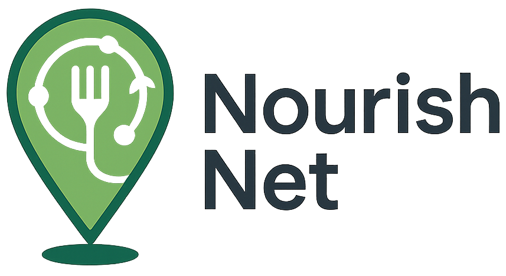

# NourishNet 🌱

[](https://opensource.org/licenses/MIT)
[](https://nextjs.org/)
[](https://www.typescriptlang.org/)
[](https://tailwindcss.com/)
[](https://reactjs.org/)
[](https://nodejs.org/)

NourishNet is a food donation and redistribution platform that connects food donors with volunteers and recipients to reduce food waste and fight hunger in local communities. Our mission is to create a sustainable solution for food redistribution while empowering communities to come together and make a difference.

## ✨ Features

- 🗺️ **Interactive Map** - Find nearby food donations with real-time location tracking
- 🍎 **Donation Listings** - Browse and search for available food donations with detailed information
- 🤝 **Volunteer Coordination** - Connect donors with volunteers for food pickup and delivery
- 📊 **Impact Dashboard** - Track the positive impact of donations with beautiful visualizations
- 🔮 **Forecasting** - Predict upcoming donation supply and recipient demand for proactive planning
- 🔔 **Real-time Updates** - Get instant notifications about donation status and matches
- 📱 **Mobile-First Design** - Fully responsive interface that works on all devices
- 🔒 **Secure Authentication** - Safe and secure user authentication and authorization
- 🌍 **Community Focus** - Connect with local organizations and community members

## 🚀 Quick Start

### Prerequisites

- Node.js 18.17.1 or later
- npm (v9+) or yarn (v1.22+)
- Git 2.25.0 or later

The Next.js source code resides in `Frontend/`, which contains its own `package.json`. Run `npm` commands from inside this directory.

### Installation

1. **Clone the repository**
   ```bash
   git clone https://github.com/rabu20367/NourishNet.git
   cd NourishNet
   ```

## 📈 Forecasting

Daily cron jobs retrain time-series models using Prophet to predict donation supply and recipient demand.
Forecast results are stored in the `forecasts` collection and surfaced on the dashboard.
Run the scheduler locally with:

```bash
npm run forecast:cron
```

## 🖼️ Computer Vision Model

Labeled food photos can be used to train a lightweight PyTorch model that estimates the food type, weight,
and checks for spoilage or packaging issues. The training script lives in
`Backend/src_ai/cv-model/train_food_image_model.py` and expects an image directory and
an `annotations.json` file describing each image. After training, a scripted model is stored at
`Backend/src_ai/cv-model/food_image_model.pt`.

In production the API flow invokes `cv-model/predict.py` to analyze uploaded images and returns structured
data like `{ "foodType": "carrots", "estimatedWeightKg": 2.0, "spoilageDetected": false, "packagingOk": true }`.

2. **Change into the `Frontend` directory**

   ```bash
   cd Frontend
   ```

3. **Install dependencies** (run inside `Frontend`)
   
   ```bash
   npm install
   # or
   yarn install
   ```

4. **Set up environment variables**

   ```bash
   cp .env.example .env.local
   ```

   Update the `.env.local` file with your configuration:

   ```env
   # Required
   NEXT_PUBLIC_GOOGLE_MAPS_API_KEY=your_google_maps_api_key
   NEXT_PUBLIC_FIREBASE_API_KEY=your_firebase_api_key
   NEXT_PUBLIC_FIREBASE_AUTH_DOMAIN=your_firebase_auth_domain
   NEXT_PUBLIC_FIREBASE_PROJECT_ID=your_firebase_project_id
   NEXT_PUBLIC_FIREBASE_STORAGE_BUCKET=your_firebase_storage_bucket
   NEXT_PUBLIC_FIREBASE_MESSAGING_SENDER_ID=your_firebase_messaging_sender_id
   NEXT_PUBLIC_FIREBASE_APP_ID=your_firebase_app_id

   # Optional (for production)
   NEXT_PUBLIC_SITE_URL=http://localhost:3000
   NEXTAUTH_SECRET=your_nextauth_secret
   NEXTAUTH_URL=http://localhost:3000
   ```

5. **Run the development server** (from `Frontend`)

   ```bash
   npm run dev
   # or
   yarn dev
   ```

6. **Open your browser**
   Visit [http://localhost:3000](http://localhost:3000) to see the application running.

## 🛠️ Tech Stack

### Core Technologies

- **Frontend Framework**: [Next.js 15](https://nextjs.org/) with App Router
- **Language**: [TypeScript 5](https://www.typescriptlang.org/)
- **Styling**: [Tailwind CSS 3.4](https://tailwindcss.com/) with CSS Modules
- **UI Components**: [Radix UI](https://www.radix-ui.com/) Primitives
- **State Management**: [React Query](https://tanstack.com/query/latest)
- **Form Handling**: [React Hook Form](https://react-hook-form.com/) + [Zod](https://zod.dev/)
- **Icons**: [Lucide Icons](https://lucide.dev/)
- **Data Visualization**: [Recharts](https://recharts.org/)
- **Maps**: [Google Maps JavaScript API](https://developers.google.com/maps/documentation/javascript)

### Development Tools

- **Linting**: [ESLint](https://eslint.org/) with [TypeScript](https://typescript-eslint.io/)
- **Code Formatting**: [Prettier](https://prettier.io/)
- **Git Hooks**: [Husky](https://typicode.github.io/husky/) + [lint-staged](https://github.com/okonet/lint-staged)
- **Testing**: [Jest](https://jestjs.io/) + [React Testing Library](https://testing-library.com/)
- **AI Integration**: [Genkit](https://genkit.ai/) for AI-powered features

## 📁 Project Structure

```
.
├── Backend/             # Next.js backend and package.json
│   ├── package.json
│   └── src_ai/          # ML and Genkit flows
├── Frontend/            # Next.js application source
│   ├── app/             # App router pages and layouts
│   ├── src/components/  # Reusable UI components
│   ├── src/hooks/       # Custom React hooks
│   ├── src/lib/         # Shared utilities
│   └── next.config.ts   # Next.js configuration
├── docs/                # Documentation
├── CODE_OF_CONDUCT.md
├── CONTRIBUTING.md
├── LICENSE
└── SECURITY.md
```

## 🧪 Testing

Run the test suite with:

```bash
npm test
# or
yarn test
```

Run tests in watch mode:

```bash
npm run test:watch
# or
yarn test:watch
```

Generate test coverage report:

```bash
npm run test:coverage
# or
yarn test:coverage
```

## 🛡️ Security

Please refer to our [Security Policy](SECURITY.md) for reporting vulnerabilities.

## ⚙️ ML Pipelines

Automation scripts for model training and data drift detection are located in `.github/workflows/ml_pipeline.yml`.
See [docs/ml_pipeline_setup.md](docs/ml_pipeline_setup.md) for local setup instructions.


## 🤝 Contributing

We welcome contributions from the community! Here's how you can help:

1. **Report Bugs**

   - Check if the issue already exists in the [Issues](https://github.com/rabu20367/NourishNet/issues) section
   - If not, create a new issue with a clear description and steps to reproduce

2. **Suggest Enhancements**

   - Open an issue to discuss your ideas
   - Follow the issue template and provide as much detail as possible

3. **Submit Pull Requests**

   ```bash
   # 1. Fork the repository
   # 2. Create your feature branch
   git checkout -b feature/amazing-feature
   # 3. Commit your changes
   git commit -m 'Add some amazing feature'
   # 4. Push to the branch
   git push origin feature/amazing-feature
   # 5. Open a Pull Request
   ```

4. **Code Style**
   - Follow the existing code style (enforced by ESLint and Prettier)
   - Write meaningful commit messages
   - Add tests for new features and bug fixes

## 📄 License

Distributed under the MIT License. See [LICENSE](LICENSE) for more information.

## 🙏 Acknowledgments

- [Next.js Documentation](https://nextjs.org/docs) - For the amazing framework
- [Tailwind CSS](https://tailwindcss.com/) - For the utility-first CSS framework
- [Radix UI](https://www.radix-ui.com/) - For accessible UI primitives
- [React Query](https://tanstack.com/query) - For server state management
- [Open Source Community](https://opensource.org/) - For inspiration and resources

## 🌟 Contributors

Thanks to all the people who have contributed to NourishNet!

[//]: # "Contributors list will be auto-generated by all-contributors"

## 📬 Contact

Project Maintainer: Hasibur Rashid - atm.hasibur.rashid20367@gmail.com

Project Link: [https://github.com/rabu20367/NourishNet](https://github.com/rabu20367/NourishNet)

---

<div align="center">
  Made with ❤️ by the NourishNet Team
</div>
- [Tailwind CSS Documentation](https://tailwindcss.com/docs)
- [Shadcn/ui](https://ui.shadcn.com/)
- [Radix UI](https://www.radix-ui.com/)
